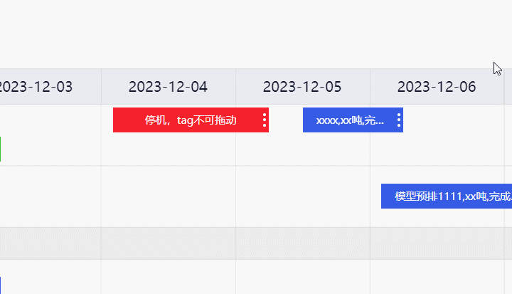
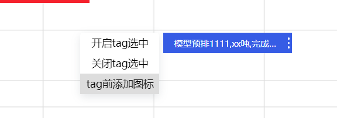
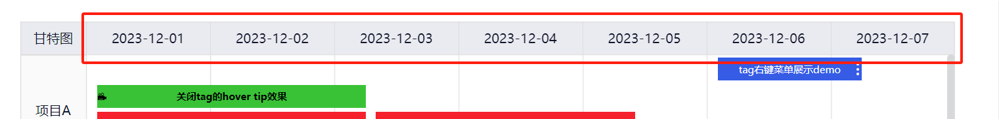
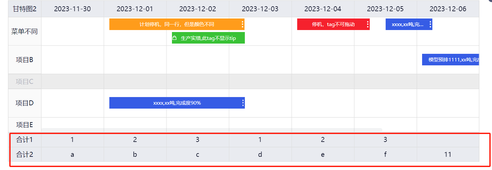
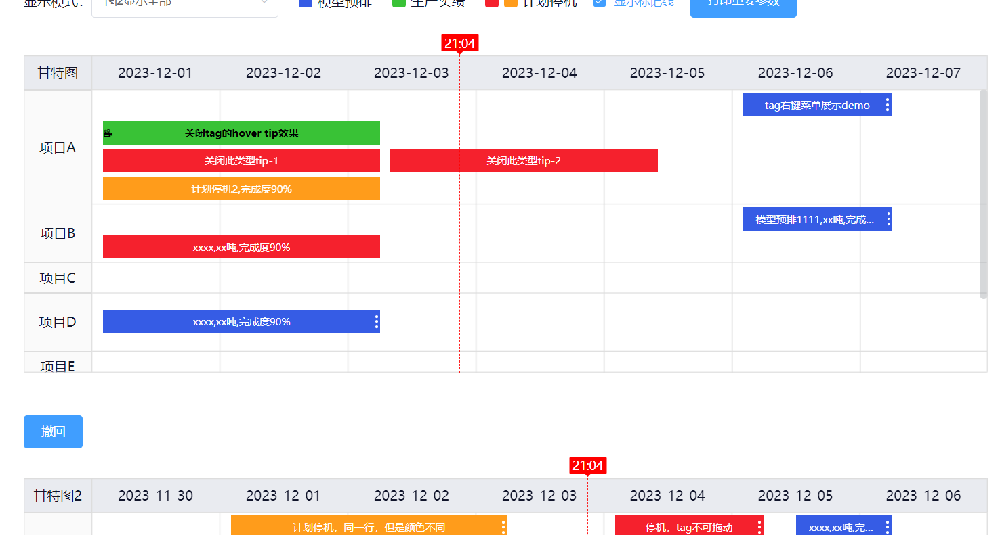
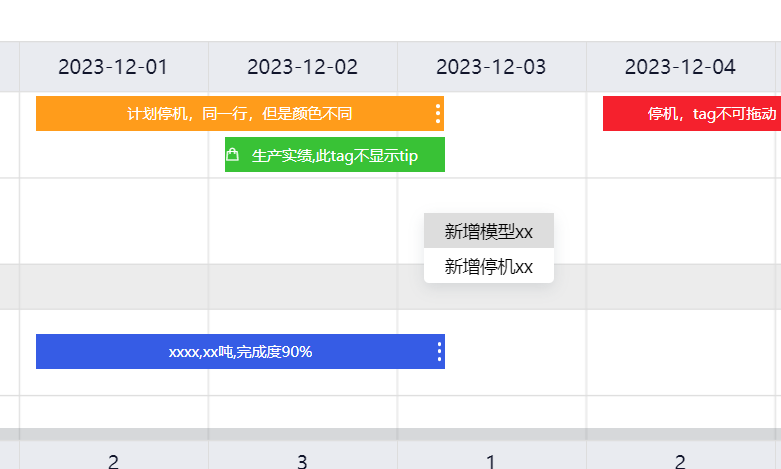
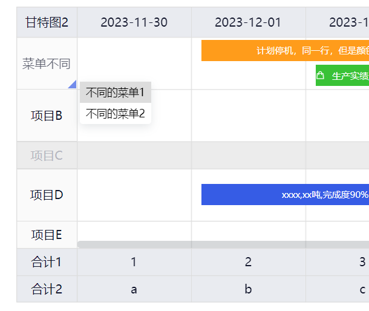
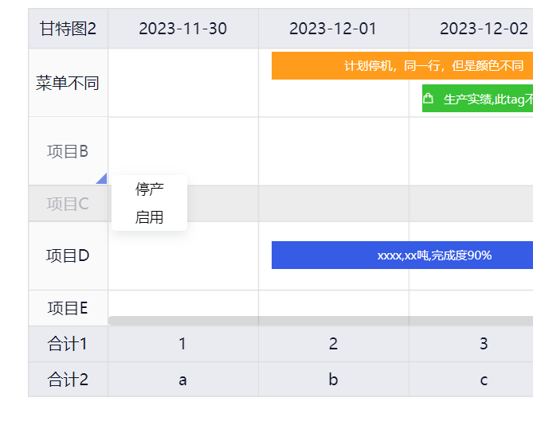
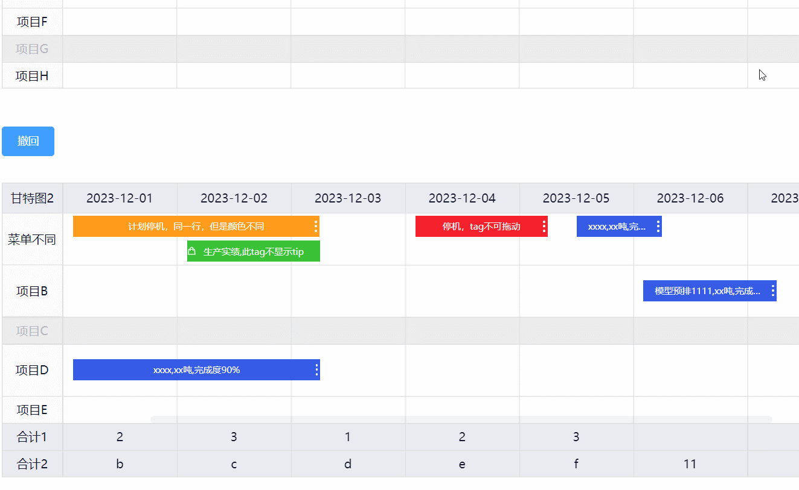

# gantt-chart-vue 一个使用vue2.x开发的甘特图组件
这个组件是我“被裁员期间”抽空给之前呆过的公司【重庆隆志科技有限公司】写的，大家**在二次开发的时候记得保留代码顶部的版权声明文件哦。通过npm 安装原始版本不用管，复制源码然后二次修改才需要这样。**
```
<!-- /**
 * Copyright (c) 2023 重庆隆志科技有限公司. All rights reserved.
 * author: yangfeng
 * blog: https://www.jianshu.com/u/71a7345bdabf
 * date: 2024/01/08
 * remark: 如果要分发gantt-chart-vue源码，需在本文件顶部保留此文件头信息！！
 */ -->
```

## 目录说明
packages下是gantt-chart-vue 组件源码  
examples下是demo代码，根目录下执行 `npm run serve`启动项目  

## 支持vue2.x
## 功能
* 1.甘特图精度显示到“分钟”。
* 2.甘特图支持只读模式。
* 3.甘特图支持点击显示标记线，标记线多个甘特图联动，通过.sync 实现。
* 4.支持在甘特图中标记当前时间-时间线，前提是当前时间在任务开始结束区间内。
* 5.甘特图支持底部支持显示统计行。
* 6.甘特图支持是否开启甘特图高度自适应：  
    true：限定在父级设置的高度范围内，超出将显示纵向滚动条，如果父容器未设置高度，将以初始渲染的高度为准，后续都限定在此高度范围内。  
    false：甘特图自动撑开，特别注意父容器不要设置高度！！！
* 7.甘特图支持右键菜单，通过rightClickMenuList属性配置。
* 8.甘特图支持给左侧任务列配置右键菜单，通过taskMenuList属性配置。  
    任务列菜单 - 每行的菜单都一样，若想给某行单独设置不同的菜单，则给row 对应行赋值 taskMenuList
* 9.每行任务支持同时显示多种类型的tag，可拖动tag到其他行列，不同类型tag将在不同行显示。
* 10.拖动tag时tag左侧显示时间线。
* 11.支持给任务行设置是否禁用，禁用行可设置是否响应事件【不响应则不可拖入禁用行】，可通过disabledRowSilent属性控制是否开启。
* 12.tag tooltip 采用 el-popover实现, 默认显示tag的tooltip、支持单个tag的tip关闭、使用插槽父组件可自行修改tag tooltip内容。  
  tip 显示的优先级为：当前tag 设置的closeTip > 当前tag对应legend设置的closeTip > 都没设置则默认显示tip。
* 13.tag支持右键菜单，tag 右键菜单功能，菜单在legend中配置，点击菜单按钮抛出参数。
* 14.想要时间更精确，当tag拖动，结束后可以弹窗选择起止时间，可通过dragTagEndShowTimeDialog控制是否开启此功能。
* 15.tag 支持点击显示选中效果tag selected为true即可，可以全局关闭，提供获取所有选中项，清空所有选中项api。
* 16.tag 前可以显示自定义图标，就是个类名放到tag前的 `<i>` 标签里面，推荐使用iconfont。
* 17.甘特图支持实现任务持续时间加减n天显示，tag拖动到有滚动条边界时时滚动条滚动。
* 18.甘特图支持tag拖动时，后面tag的避让效果。  
    特别注意：拖动结束后需要重新触发甘特图init方法才会清除避让信息！这部分是垃圾数据，只是为了有个避让效果，和甘特图本身数据无关

## 注意
甘特图tag是以左上角点位置判断拖到的哪行。

## 效果图


## 安装
npm i gantt-chart-vue -S

## 引入
### 方式一，main.js中全局引入
```js
import Vue from 'vue'
import App from './App.vue'

// vue插件方式引入
import * as ganttChartVue from 'gantt-chart-vue'
Vue.use(ganttChartVue)

Vue.config.productionTip = false
new Vue({
  render: h => h(App),
}).$mount('#app')

```
### 方式二
```js
import ganttChartVue from 'gantt-chart-vue'

export default {
  ...
  components: {
        ganttChartVue
  }
  ...
}
```
### 基础使用代码
``` vue
<template>
  <div>
  <!-- 默认值测试 -->
  <gantt-chart-vue ref="ganTT1" v-bind="ganTT1Option" />
  </div>
</template>

<script>
import ganttChartVue from 'gantt-chart-vue'
export default {
  components: {
        ganttChartVue
    },
  data(){
    return {
      ganTT1Option: {
                readOnly: false, // 只读模式
                title: '甘特图',
                legend: [
                    {
                        label: '模型预排',
                        color: '#365ce5',
                        type: 1, // 用于判定同一网格行内具体所属行
                        dragable: true, // 此类型tag是否可以拖动，也可以在rows中配置单个tag是否可以拖动
                        closeTip: false, // 显示tag tip，也可以在rows中配置单个tag是否关闭提示
                        btnList: [ // 右键菜单按钮列表
                            {
                                label: '开启tag选中',
                                disabled: false
                            },
                            {
                                label: '关闭tag选中',
                                disabled: false
                            },
                            {
                                label: 'tag前添加图标',
                                disabled: false
                            }
                        ]
                    },
                    {
                        label: '生产实绩',
                        color: '#39c236',
                        type: 2, // 用于判定同一网格行内具体所属行
                    },
                    {
                        label: '计划停机1',
                        color: '#f5212d',
                        type: 3, // 用于判定同一网格行内具体所属行
                        closeTip: true // 关闭此大类的tag tip，若tag自行设置有closeTip，则以tag 内的为准
                    },
                    {
                        label: '计划停机2',
                        color: '#ff9c1b',
                        type: 4 // 用于判定同一网格行内具体所属行
                    }
                ],
                rows: [
                    {
                        label: '项目A',
                        tags: [
                            {
                                startTime: '2023/12/01 02:10:00',
                                endTime: '2023/12/03 06:10:00',
                                label: '关闭此类型tip-1',
                                type: 3
                            },
                            {
                                startTime: '2023/12/01 02:10:00',
                                endTime: '2023/12/03 06:10:00',
                                label: '计划停机2,完成度90%',
                                type: 4
                            },
                            {
                                startTime: '2023/12/03 08:00:00',
                                endTime: '2023/12/05 10:10:00',
                                label: '关闭此类型tip-2',
                                type: 3
                            },
                            {
                                startTime: '2023/12/06 02:10:00',
                                endTime: '2023/12/07 06:00:00',
                                label: 'tag右键菜单展示demo',
                                type: 1
                            },
                        ]
                    },
                    {
                        label: '项目B',
                        tags: [
                            {
                                startTime: '2023/12/06 02:10:00',
                                endTime: '2023/12/07 06:10:00',
                                label: '模型预排1111,xx吨,完成度90%',
                                type: 1
                            },
                        ]
                    },
                    {
                        label: '项目C',
                        tags: []
                    },
                    {
                        label: '项目D',
                        tags: [
                            {
                                startTime: '2023/12/01 02:10:00',
                                endTime: '2023/12/03 06:10:00',
                                label: 'xxxx,xx吨,完成度90%',
                                type: 1
                            },
                        ]
                    },
                    {
                        label: '项目E',
                        tags: []
                    },
                    {
                        label: '项目F',
                        tags: []
                    },
                    {
                        label: '项目G',
                        disabled: true, // 禁止响应事件
                        tags: []
                    },
                    {
                        label: '项目H',
                        tags: []
                    },
                ],
                startDate: '2023/12/01',
                dateDuration: 7
            },
    }
  }
}
</script>
<style scoped>
</style>

```

# 组件 props 属性值介绍，可查看源码 `packages/components/index.vue` 查看所有props
## readOnly
`boolean`，是否只读，最高优先级，为true会禁用所有编辑功能，如拖拽，右键菜单等
## disabledRowSilent
`boolean`，禁用行是否不触发事件，tag不可拖动到禁用行，不触发右键菜单 true：禁止拖入 false：可以拖入。禁用行是根据rows中每个item的 disabled 属性判断的。
## showSelected
`boolean`，是否显示tag选中 - false 不会显示选中效果，true 显示选中效果【tag是否选中是通过rows中每个item的selected控制的】


## selfAdaptionGanTTHeight
`boolean`，是否开启甘特图高度自适应：  
true：限定在父级设置的高度范围内，超出将显示纵向滚动条，如果父容器未设置高度，将以初始渲染的高度为准，后续都限定在此高度范围内  
false：甘特图自动撑开，特别注意父容器不要设置高度！！！  

## legend
类型为：
``` typescript
interface Ilegendtype{
  color: string;
  type: number;
  dragable?: boolean;
  closeTip?: boolean;
  btnList: {
    label:string;
    disabled?: boolean;
  }[]
}
type Ilegend = Ilegendtype[]
```
甘特图的类型数组，重要！！！，用于控制每行tag的颜色以及行的顺序。完整值例子如：
```js
[
    {
    color: '#365ce5',
    type: 1, // 用于判定同一网格行内具体所属行
    dragable: true, // 此类型tag是否可以拖动，也可以在rows中配置单个tag是否可以拖动
    closeTip: false, // 显示tag tip，也可以在rows中配置单个tag是否关闭提示
    btnList: [ // 右键菜单按钮列表
        {
        label: '开启tag选中',
        disabled: false
        },
        {
        label: '关闭tag选中',
        disabled: false
        },
        {
        label: 'tag前添加图标',
        disabled: false
        }
        ]
    }
]
```
* color: 这种类型tag的背景色【tip：想要设置tag自己的样式请在rows对应项中设置tags的className修改】
* type: 用于判定同一网格行内具体所属行
* dragable: 此类型tag是否可以拖动，也可以在rows中配置单个tag是否可以拖动
* closeTip: 此类型是否显示tag tip，也可以在rows中配置单个tag是否关闭提示，true：不显示tip false：显示tip
* btnList: tag上的右键菜单按钮列表，也可以设置是否禁用某个按钮，效果为:


## title
`string`，甘特图标题，默认值：'甘特图'。
## startDate
`string`，初始显示的甘特图列开始时间，默认值：'2023/12/01'。重要！！！
## dateDuration
`number`，任务持续时间 - 从开始时间计算，默认值：7。重要！！！

## decreaseDayNum
`number`，除了dateDuration任务持续时间，当tag横向拖动到左边界时，可以往前几天时间。需求说明：
    如甘特图为7+2天，如果tag往左移出了，甘特图时间轴需要 - 1天；往右移出则 + 1 天，此时甘特图出现横向滚动条。
## IncreaseDayNum
`number`，除了dateDuration任务持续时间，当tag横向拖动到右边界时，可以往后几天时间。
## timeFormat
`string`，标题列时间显示成的格式，默认：'YYYY-MM-DD'。
## rows
甘特图行数据，重要！！！类型为：
``` typescript
interface Itags{
    startTime: string; // 此tag的开始时间，注意是完整时间，如：'2023/12/01 02:10:00'
    endTime: string; // 此tag的开始时间，注意是完整时间，如：'2023/12/03 06:10:00'
    label: string; // tag上显示的文本
    type: number; // 同 legend 中的type类型 Ilegendtype.type，用于判断显示在同一任务行中的哪一行
    closeTip: boolean; // 不显示此tag的tip，注意：只有true|false才会生效
    dragable: boolean; // 此类型tag是否可以拖动,优先级最高，不设置将取legend的dragable，都没有则禁止拖动，注意：只有true|false才会生效
    className: string; // 可单独设置tag样式名，可以同时设置多个，如：'classA classB'，将给此tag加上样式classA和样式classB
    selected: boolean; // 当前tag是否选中-有选中样式
    preIcon: string; // tag 前可以显示自定义图标，就是个类名放到tag前的 <i> 标签里面，推荐使用iconfont，如'el-icon-video-camera-solid'
    hide: boolean; // 是否隐藏此tag
}

interface Ibtn{
    label: string; // 按钮名称
    disabled?: boolean; // 是否禁用
}

interface IRowsItem{
 label: string; // 任务行名称
 disabled?: boolean; // 当前行是否标记为禁用行，若props.disabledRowSilent设置为true，将禁止tag拖入禁用行
 tags: Itags[];
 h?:number; // 甘特图内部会用的变量，不用传，传了也会被覆盖
 taskMenuList?: Ibtn[]; // 当前任务行中任务列的右键菜单，参数和效果同 props.taskMenuList
 // 其他属性，将不做任何修改，可以存储其他前端数据
 [[propName: string]: any;]
}

type IRows = IRowsItem[]

```
## summaryRows
`string[]`，甘特图底部统计行。注意上面的任务时间【包括加减n天】有几列这里就得有几列。  
如：
```js
    // 甘特图底部统计行
    summaryRows: {
        type: Array,
        default() {
        return [
           ['合计1', '1', '2', '3', '1', '2', '3', ''],
           ['合计2', 'a', 'b', 'c', 'd', 'e', 'f', '11'],
        ]
        }
    },
```

## showMarkLine
`boolean`，是否显示标线，注意：只读模式下标线功能未禁止，同样可以显示和标记。
## markLineTime
`string`，标记线对应的时间，注意是完整时间，如：'2023/10/04 06:10:00'。标记线的功能为：点击甘特图内容区域，在点击的时间显示一条纵向线，后续可搭配 getTimePierceTags 方法获取所有被指定时间贯穿的tag。demo中有例子，感兴趣可以运行起来看看。
如图：

## rightClickMenuList
甘特图右键菜单里面的按钮，类型为：
```typescript
interface Ibtn{
    label: string; // 按钮名称
    disabled?: boolean; // 是否禁用
}
type IrightClickMenuList = Ibtn[]
```
值如：
```js
    rightClickMenuList: {
      type: Array,
      default() {
        return [
                {
                    label: '新增模型xx',
                    disabled: true
                },
                {
                    label: '新增停机xx',
                    disabled: false // 是否禁用
                }
        ]
      }
    },
```
效果图：


## taskMenuList
任务列菜单 - 每行的菜单都一样，若想给某行单独设置不同的菜单，则给row 对应行赋值 `taskMenuList`，上面props.rows中有讲到过。  
类型为：
```typescript
interface Ibtn{
    label: string; // 按钮名称
    disabled?: boolean; // 是否禁用
}
type ItaskMenuList = Ibtn[]
```
值如：
```js
    taskMenuList: {
      type: Array,
      default() {
        return [
                {
                    label: '停产',
                    disabled: false // 是否禁用
                },
                {
                    label: '启用',
                    disabled: false // 是否禁用
                }
        ]
      }
    },
```
效果图：


## dragTagEndShowTimeDialog
`boolean`，tag拖拽结束是否显示时间选择框，默认：false。

## openTagMoveDodgeAnimate
`boolean`，tag拖动的避让效果，只是单纯显示，原理: 修改translateX(x)，这样不会对原始数据造成影响，非必要不用开启此功能。  
**【注意!!!：开启此功能后，将导致某些tag含有translateX 偏移，从而让甘特图表现异常-正确用法是每次拖动结束【比如调接口计算】，然后重新渲染整个甘特图】**


### 下面几个 props 属性是样式属性
## ganttBgColor
`string`，甘特图背景色，默认：'#ffffff'。
## disabledBgColor
`string`，停用|禁用行-背景色，默认：'#ececec'。
## paintLeft
`string`，画布左侧 “类目列” 宽，默认：'80px'。
## paintTop
`string`，画布顶部 “时间列” 高，默认：'40px'。
## gridLineColor
`string`，网格线的颜色，默认：'#dddddd'。